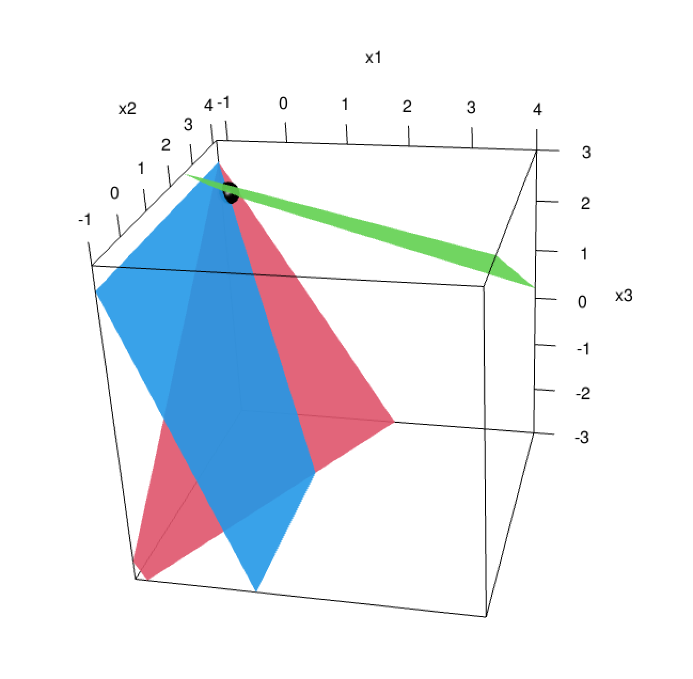
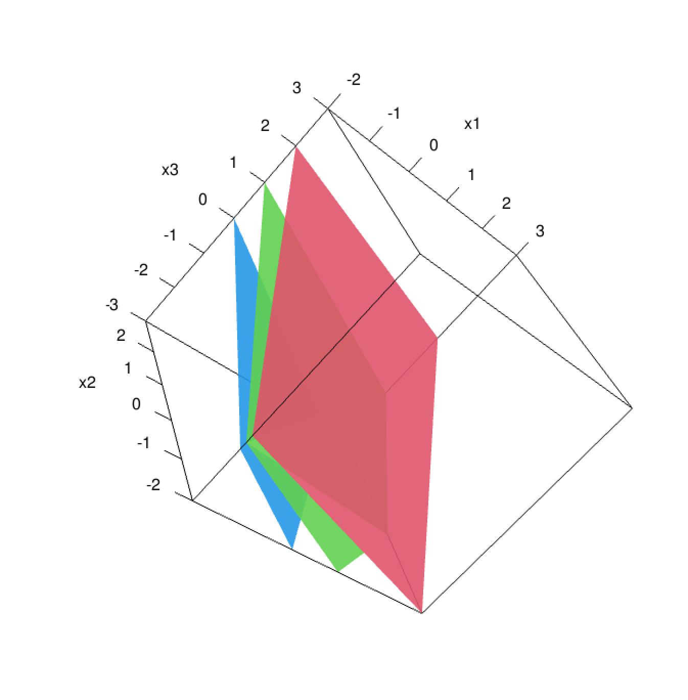

>  In this portfolio piece, I will demonstrate how to do some math in R. It turns out a lot of it is NOT enjoyable in R, so I am going to stick with solving and visualizing some simple systems of equations. 


```{r echo=FALSE, load-packages, message=FALSE, warning=FALSE}
library(tidyverse) 
library(tidyr)
library(mosaicCalc)
library(pracma) #for RREF 
#this is also helpful and necessary 
help(package="mosaicCalc")
library(knitr)
library(kableExtra)
library(rgl)
library(matlib)
```

Lets slap together a system of equations and make a matrix:
```{r echo=FALSE, message=FALSE, warning=FALSE}

A <- matrix(c(-2,1,3,
              1,2,0,
              -1,3,1,
              4,13,-1), nrow=3)
A %>% kable(col.names = c("X", "Y","Z","."), caption = "System of Equations" )
```

To solve this system, we just take the Reduced Row Echelon Form of the matrix (RREF). We get exactly one solution, x=-1, y=4, z=2

```{r echo=FALSE, message=FALSE, warning=FALSE}
kable(rref(A), caption = "Reduced Row Echelon Form")
```

Lets do it with one more system: 
```{r echo=FALSE, message=FALSE, warning=FALSE}
B <- matrix(c(1,-1,2,
              -2,1,-1,
              3,-2,3,
              -2,3,-7), nrow=3)

B %>% kable(col.names = c("X", "Y","Z", "."), caption = "System of Equations" )

kable(rref(B), caption = "Reduced Row Echelon Form")

```
This is a dependent system with infinitely many solutions. let z = t, then x = -t-4, y = t-1, and we get solutions for any real number t. 

## Now I will try to plot this stuff with matlib plot functions

Side note: it took a very long time to get these to work because I had to install some extra stuff (XQuartz), update my version of R, and get the rgl package working. It was worth it though! This technique creates some really cool 3d interactive plots, but they don't show up in rmd. I can only view them in XQuartz. I will provide the code I used and the screenshots from XQuartz :-l

### Starting with the first example: 

```{r message=FALSE, warning=FALSE}
#1
A <- matrix(c(-2,1,3,
              1,2,0,
              -1,3,1), nrow=3)

b <- c( 4,13,-1)
```
```{r echo=FALSE, message=FALSE, warning=FALSE}
#kable(Solve(A, b, fractions=TRUE), col.names = "Solution")
Solve(A,b, fractions=TRUE)
```
```{r message=FALSE, warning=FALSE}
plotEqn3d(A,b, xlim=c(-1,4), ylim=c(-1,4))
```

```{r echo=FALSE, message=FALSE, warning=FALSE}
 
```

The second system of equations: 
```{r echo=FALSE, message=FALSE, warning=FALSE}
C <- matrix(c(1,-1,2,
              -2,1,-1,
              3,-2,3), nrow=3)
d <-c(-2,3,-7)

```
```{r echo=FALSE, message=FALSE, warning=FALSE}
kable(showEqn(C,d), col.names = "System of Equations")
```
```{r message=FALSE, warning=FALSE}
plotEqn3d(C, d)
```

```{r echo=FALSE, message=FALSE, warning=FALSE}
 

```


## The output of this project isn't massive but I swear this took me a while to figure out. I am quite satisfied with this plotting technique! 


