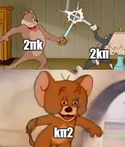

Loading packages and sourcing my BG helpers 
```{r message=FALSE, warning=FALSE}
library(BGmisc)
library(ggplot2)
library(ggpedigree)
library(OpenMx)
library(EasyMx)
library(ACEsimFit)
library(tidyr)
library(dplyr)
library(purrr)
library(polycor)
library(lattice)
library(broom)
library(knitr)
library(kableExtra)

source("/Users/caileyfay/Documents/Research/Github/risky_gambling/helpers.R")
source("/Users/caileyfay/Documents/Research/Github/risky_gambling/EasyMx/R/emxBehaviorGenetics.R")
source("/Users/caileyfay/Documents/Research/Github/risky_gambling/data/miFunctions.R")
```

First I create some simulated data to work on, and the I save all my results as a data frame.  
```{r message=FALSE, warning=FALSE, results='hide'}
sim <- Sim_Fit(
  GroupNames = c("KinPair1", "KinPair2"),
  GroupSizes = c(2000, 2000),
  nIter = 10,
  SSeed = 2,
  GroupRel = c(.5, 0.25),
  GroupR_c = c(1, 1),
  mu = c(15, 15), 
  ace1 = c(.3, .2, .5),
  ace2 = c(.3, .2, .5),
  ifComb = FALSE,
  lbound = FALSE,
  saveRaw = TRUE)

df_list <- map(sim, ~ as.data.frame(.x$data))
list2env(df_list, envir = .GlobalEnv)
```

The next step is to make it plausible for drug initation data - that means some people need to have NAs to represent non-use. I also have to make this into a loop or use the map function to scale it up to handle all the iterations. 

```{r message=FALSE, warning=FALSE, results='hide'}
for (i in 1:length(df_list)) {
  
  df_list[[i]] <- df_list[[i]] %>%

 mutate(y1 = case_when(
    R == .5 ~ ifelse(runif(n()) < 0.20, NA, y1), 
     R == .25 ~ ifelse(runif(n()) < 0.10, NA, y1)))  %>%
    
  mutate(y2 = case_when(
    is.na(y1) ~ NA, 
    TRUE ~ y2
  )) %>%
  mutate(Ord_1 = case_when(
    y1 <= 14 ~ 1,
  y1 <= 15 ~ 2,
  y1 <= 16 ~ 3,
  y1 >= 17 ~ 4,
  is.na(y1) ~ 4,
  ),
  Ord_2 = case_when(
    y2 <= 14 ~ 1,
  y2 <= 15 ~ 2,
  y2 <= 16 ~ 3,
  y2 >= 17 ~ 4,
 is.na(y2) ~ 4,
  )) %>%
  mutate(RCoef = R)
}

list2env(df_list, envir = .GlobalEnv)
```

## ACE modeling (Hermine's Method) with Iteration 1

### Ordinal Results 

```{r include=FALSE, message=FALSE, warning=FALSE, results='hide'}
sim_df <- Iteration1 #relic of past naming convention but too much work to change across files at this point 
source("/Users/caileyfay/Documents/Research/Github/risky_gambling/sim_df_ordinal_ACE.r")
sumACE
summary(fitACE, verbose=TRUE)
LL_ACE #ACE log liklihood
#plot(fitACE, std=TRUE)
#omxGraphviz(modelACE, dotFilename="model_plot.dot")
```
```{r echo=FALSE, message=FALSE, warning=FALSE}
rownames(estACE) <- c("Unstandardized", "Standardized")
colnames(estACE) <- c("A","C","E")
kable(estACE, caption="Ordinal ACE Model Estimates") 
```
Side note: In this case I did not have to standardize anything, but I just pulled it out with the same method, hence the confusing identical standardized and unstandardized rows. Will try to circle back to deal with this. 

### Interval Results 

```{r include=FALSE, results='hide'}
source("~/Documents/Research/Github/risky_gambling/sim_df_interval_ACE.r")
sumACE
```
```{r echo=FALSE, message=FALSE, warning=FALSE}
rownames(estACE) <- c("Unstandardized", "Standardized")
colnames(estACE) <- c("A","C","E")
kable(estACE, caption = "Interval ACE Model Estimates")
```

I got mad trying to plot a path diagram with the openMx functions (they are totally useless and don't work with my mxobjects, which is ironic). So I asked Gemini how it would do this, given an openMx ACE output. For your entertainment, this is what it gave me. 

```{r echo=FALSE, message=FALSE, warning=FALSE}
library(DiagrammeR)

# Create the diagram using the values calculated above
DiagrammeR::grViz(paste0("
digraph ACE_Model {
  graph [layout = neato, overlap = FALSE, outputorder = edgesfirst]
  
  # Latent Variables
  node [shape = circle, fixedsize = true, width = 0.8]
  A [label = 'A']; C [label = 'C']; E [label = 'E']
  
  # Observed Variable
  node [shape = box, fixedsize = true, width = 1.2]
  Trait [label = 'Observed\nTrait']
  
  # Paths and Labels
  A -> Trait [label = '", round(a2, 2), "']
  C -> Trait [label = '", round(c2, 2), "']
  E -> Trait [label = '", round(e2, 2), "']
}
"))
```

It reminds me of the graphing equivalent to this gem. 


```{r echo=FALSE, message=FALSE, warning=FALSE}

```


### Descriptives: Interval ACE uses the first variable, Ordinal uses the second. 

```{r echo=FALSE, message=FALSE, warning=FALSE}
ggplot(sim_df, mapping=aes(x=y1)) +
 geom_histogram(fill="lightblue") + 
  theme_minimal() + 
  labs(title="Sibling 1 Distribution of Age at Drug Initation",
       x="Age",
       y="Frequency")
                                                
ggplot(sim_df, mapping=aes(x=Ord_1)) +
 geom_histogram(fill="lightblue") + 
  theme_minimal() + 
  labs(title="Distribution of Age at Drug Initation",
       x="Sibling 1 Age Bracket",
       y="Frequency")

```

```{r include=FALSE}
#I want to note that the way I am pulling out the estimates from my results is this: 
# Generate & Print Output
# additive genetic variance, a^2
#A  <- mxEval(VA11*VA11, fitACE)
# shared environmental variance, c^2
#C  <- mxEval(VC11*VC11, fitACE)
# unique environmental variance, e^2
#E  <- mxEval(VE11*VE11, fitACE)
# total variance
#V  <- (A+C+E)
# standardized A
#a2 <- A/V
# standardized C
#c2 <- C/V
# standardized E
#e2 <- E/V
# table of estimates
#estACE <- rbind(cbind(A,C,E),cbind(a2,c2,e2))
# likelihood of ACE model
#LL_ACE <- mxEval(fitfunction, fitACE)

# *find it tucked in at the bottom of the hermine scripts
# It provides me a with a data frame with two rows and three columns - row 1 is unstandardized ACE, row 2 is standardized. I got this method from https://openmx.ssri.psu.edu/docs/OpenMx/2.5.1/GeneticEpi_Path.html and just renamed a few things to get it working for Hermine scripts. I feel a little silly I didn't just do it by hand myself, because its actually not that hard, but either way, credit where credit is due. 
```


## Interval ACE with Easymx 

emxTwinModel function already modified (sourced at the beginning). 
```{r echo=FALSE, message=FALSE, warning=FALSE, results='hide'}
model <- emxTwinModel(model="Cholesky", relatedness ='RCoef', data=Iteration1, run=TRUE, use=c('y1','y2'), name='model', components='ACE')
sumACE
estimate <- c(.472, .155, .4099)
lbound <- c(.2329755, .0582, .261268)
ubound <- c(.713447,.25133,.56227)
name <- c("A","C","E")
easy_result <- data.frame(name, lbound,estimate,ubound)
kable(easy_result, caption = "EasyMx Interval ACE Results for Iteration 1")
```

Now I want to repeat this for the other 9 iterations 
```{r echo=FALSE, message=TRUE, warning=FALSE, results='hide'}
run_int <- function(df) {
   model <- emxTwinModel(model="Cholesky", relatedness ='RCoef', data=df, run=TRUE, use=c('y1','y2'), name='model', components='ACE')
   }
results <- lapply(df_list, run_int)
results
```

### This is not so easy 

Now I have a big list of model outputs, but I can't do anything with it. I want means, parameters, and I want it clean and easy like it was for the Hermine scripts. 

#### Option 1: Try to figure out a clean way of extracting parameters with EasyMx

```{r echo=FALSE, message=FALSE, warning=FALSE, results='hide'}
R1 <- summary(results$Iteration1)
estimates_df1 <- R1$algebra

#now scale it up so I don't have to repeat manually ten times 
#can't figure it out yet with lapply so I am going to for loop it 

estimates_list <- lapply(results, function(fit) {
  s <- summary(fit)
  return(s$parameters) 
})

#fuck it 
R1 <- summary(results$Iteration1)
estimates_df1 <- R1$parameters
R2 <- summary(results$Iteration2)
estimates_df2 <- R2$parameters
R3 <- summary(results$Iteration3)
estimates_df3 <- R3$parameters
R4 <- summary(results$Iteration4)
estimates_df4 <- R4$parameters
R5 <- summary(results$Iteration5)
estimates_df5 <- R5$parameters
R6 <- summary(results$Iteration6)
estimates_df6 <- R6$parameters
R7 <- summary(results$Iteration7)
estimates_df7 <- R7$parameters
R8 <- summary(results$Iteration8)
estimates_df8 <- R8$parameters
R9 <- summary(results$Iteration9)
estimates_df9 <- R9$parameters
R10 <- summary(results$Iteration10)
estimates_df10 <- R10$parameters

estimates_list <- list(estimates_df1, estimates_df2, estimates_df3, estimates_df4, estimates_df5, estimates_df6, estimates_df7, estimates_df8, estimates_df10)
estimates_list
```


Now I want to make a function that uses my method for standardizing A,C,E and putting it into tables 

1) lets try it out on Iteration 2 
```{r message=FALSE, warning=FALSE, results='hide'}
estimates_df2

# Generate & Print Output
# additive genetic variance, a^2
A <- estimates_df2$Estimate[estimates_df2$name == "sqrtA11"]^2
# shared environmental variance, c^2
C  <- estimates_df2$Estimate[estimates_df2$name == "sqrtC11"]^2
# unique environmental variance, e^2
E  <- estimates_df2$Estimate[estimates_df2$name == "sqrtE11"]^2
# total variance
V  <- (A+C+E)
# standardized A
a2 <- A/V
# standardized C
c2 <- C/V
# standardized E
e2 <- E/V
# table of estimates
standACE2 <- rbind(cbind(a2,c2,e2))
```

2) Now we scale it up by trying to make a function
```{r message=FALSE, warning=FALSE, results='hide'}
#I want to use lapply to make a standACEi for each iteration

stand <- function(data){
  A <- data$Estimate[data$name == "sqrtA11"]^2
# shared environmental variance, c^2
C  <- data$Estimate[data$name == "sqrtC11"]^2
# unique environmental variance, e^2
E  <- data$Estimate[data$name == "sqrtE11"]^2
# total variance
V  <- (A+C+E)
# standardized A
a2 <- A/V
# standardized C
c2 <- C/V
# standardized E
e2 <- E/V
# table of estimates
return(rbind(cbind(a2,c2,e2)))
}

standardized <- lapply(estimates_list, stand)
results <- do.call(rbind, standardized)

#Bind them all together at the end 
```

The numbers aren't looking quite right to me but at least now the output is in the form I wanted. At least for iteration1, EasyMx and hermines interval script produced the exact same results, but when I pull out the standardized, its wrong - maybe I am accidentally taking the square root twice? 

```{r echo=FALSE, message=FALSE, warning=FALSE}
rownames(results) <- c("1","2","3","4","5","6","7","8","10")
colnames(results) <- c("A","C","E")
kable(results, caption="Interval ACE Model Estimates Across Iterations")
```

```{r include=FALSE}
#Hot mess relic 

#just in case I want to do something with this 
# eh <- rbind(estimates_df1,estimates_df2, estimates_df3, estimates_df4, estimates_df5, estimates_df6, estimates_df7, estimates_df8, estimates_df9, estimates_df10)
# eh <- eh %>%
#   mutate(It = rep(1:10, each = 4))
# 
# A <- eh %>%
#   filter(name == "sqrtA11") #these need to be transformed so that they are actually the A ( or C or E ) so I atually probably need to approach this diffrently 
# 
# C <-eh %>%
#   filter(name == "sqrtC11")
# 
# E <- eh %>%
#   filter(name == "sqrtE11")
```

#### Option 2: Try to build a function that passes each iteraction to the hermine method

This seems hard. Leaving it be for now. 

### Phew, Time to Start Plotting 

now that the parameters stored in a more accessible way, I want to graph them as 3 overlapping density distributions.  


```{r include=FALSE}
#just thinking this through by starting very simple and layering up 
df_results <- as.data.frame(results)

ggplot(df_results, mapping=aes(x=A)) +
  geom_density()

ggplot(df_results, mapping=aes(x=C)) +
  geom_density()

ggplot(df_results, mapping=aes(x=E)) +
  geom_density()
```

Now I am going to reshape the data and plot:
```{r echo=FALSE, message=FALSE, warning=FALSE}
results_long <- pivot_longer(
  df_results,
  cols = c("A","C","E"),
  names_to = "Estimate")

results_long$Iteration <- rep(1:9, each = 3)

ggplot(results_long, mapping=aes(x=value, fill=Estimate)) + 
  geom_density() +
  scale_fill_manual(values= c("lightblue","#8EC3E6","#6BADCE")) +
  theme_minimal() +
  labs(title="Distribution of A,C,E Estimates Across 9 Iterations",
       subtitle="Simulated Parameters: A =.3, C =.2, E =.5",
       x="Value",
       y="Density",
       fill="Parameter")
```

These values aren't even close, but I am going to leave it as is for now. It would be nice to add in CIs / some kind of shading, but its probably not worth fighting with the openMx outputs to get me those. 

Hermine's script and EasyMx's get us the same result in iteration1, so that is a good sanity check. However, the way that the iterations are stored requires standardization and there are inconsistencies with how the different methods report estimates, and that makes it sketchy. I am feeling a little bit skeptical about if I correctly modified the things that needed modifying, and left the stuff alone that was already standardized. 

I did look a little closer at the EasyMx Iteration1 output, and the simulated numbers are within the CIs, so that is encouraging. 

## Further steps

Will return to the following if time allows: 
-Need to do the ordinal with easyMx - will need to modify the function 
-Need to get down to the bottom of why my EasyMx iterations are giving the wrong values. The Hermine results with iteration 1 are consistent with the simulated data, but EasyMx is not. 


