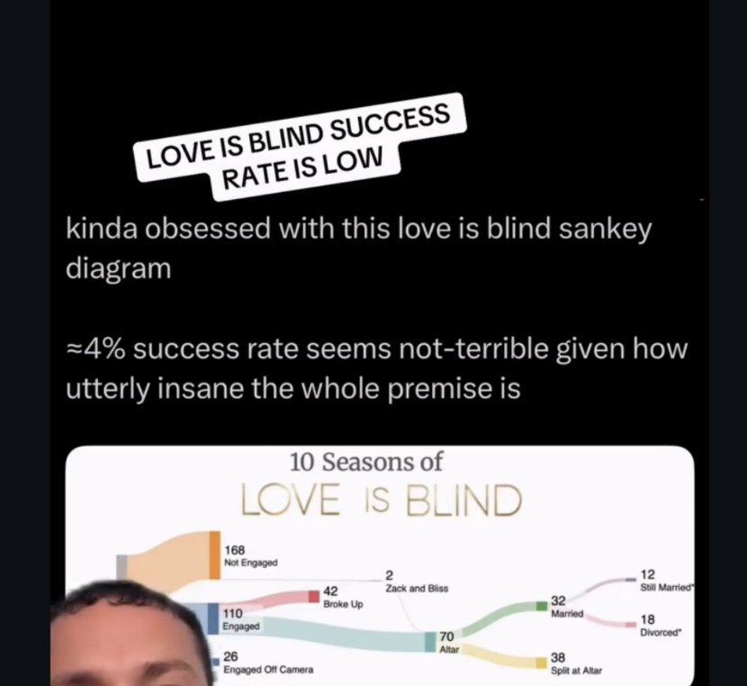

A cool plot popped up on my instagram feed and it reminded me of "Napoleon's March". The twist is, its a chart about love is blind and relationship survival. 

```{r echo=FALSE, message=FALSE, warning=FALSE}
library(ggplot2)
library(knitr)
library(tidyr)
library(dplyr)
library(ggsankey)
library(kableExtra)

```


I've decided to try to recreate it! 

On this journey, I found myself on reddit and ended up coming across this website: 
https://islovereallyblind.com/trends and this is going to be a reference for constructing some data. 

I am feeling less insecure now about making a portfolio piece. Clearly I am not the #1 superfan. 

To get me started on doing sankey diagrams with ggplot, I used this tutorial: https://r-charts.com/flow/sankey-diagram-ggplot2/ and the info in the development github repo https://github.com/davidsjoberg/ggsankey which was very helpful for figuring out how to set up the data. 

I ran their example so that I could see what the data frame should look like. 
```{r echo=FALSE, message=FALSE, warning=FALSE}
df <- mtcars %>%
  make_long(cyl, vs, am, gear, carb)

ggplot(df, aes(x = x, 
               next_x = next_x, 
               node = node, 
               next_node = next_node,
               fill = factor(node))) +
  geom_sankey() +
  scale_fill_discrete(drop=FALSE)

kable(head(df))
```

Based on this diagram and their df versus what I want, I now know the following:

* x is going to be the relationship outcome - e.g. engaged, split before alter, split at alter, etc 
 
* the node is the frequency - e.g. for x=engaged, node = 110 - actually this is not right 

* the next x is just the value of x that follows the previous x, for example, if x=alter, then next x is split at alter and married. I need to think more about how to ensure that it stacks 

* next node just refers to the frequency of the next x. If x = alter and node = 70, then next_x=married and next node = 32. 

* for dead ends, such as broke up, the next_x and next node get NAs

With this in mind, I start constructing a data frame. I am just going to try to create a series of vectors and then slap them together. My starting number is 304 singles. 

First attempt at schemeing: 
```{r echo=FALSE, message=FALSE, warning=FALSE}
x <- c("Appeared on the show", "Appeared on the show", "Appeared on the show",
       "Not Engaged", "Engaged","Engaged", "Engaged off Camera", "Broke Up", "Still Together",
       "Alter",  "Alter",
      "Married", "Married", 
      "Split at Alter", 
      "Still Married",
      "Divorced")

node <- c(0,0,0,
          1,1,1,1,
          2,2,
          3,3,
          4,4,4,
          5,5)

next_x <- c("Not engaged","Engaged","Engaged off Camera",
            "NA",
            "Broke Up",
            "Still Together",
            "NA", "Alter", "NA",
            "Married",
            "Split at Alter",
            "Still Married",
            "Divorced",
            "NA", "NA","NA")
  
next_node <-c(1,1,1,
              NA,2,3,NA,
             3, NA,
              4,4,
              5,5, 
              NA, NA, NA)

LOB <- data.frame(x, node, next_x, next_node)

kable(LOB, caption="Love Is Blind Flow Frame")

```


It took an embarrassingly long time to figure this out and fix the logic gaps to geom_sankey would be happy. Here is the final df:  

```{r echo=FALSE, message=FALSE, warning=FALSE}
x <- c("On Show",
"On Show",
"On Show",
"Not Engaged",
"Engaged off Camera",
"Engaged",
"Engaged",
"Broke Up",
"Still Together",
"Alter",
"Alter",
"Split at Alter",
"Married",
"Married",
"Still Married",
"Divorced")

node <- c(0,
0,
0,
1,
1,
1,
1,
2,
2,
3,
3,
4,
4,
4,
5,
5)

next_x <- c("Not Engaged",
"Engaged",
"Engaged off Camera",
"NA",
"NA",
"Broke Up",
"Still Together",
"NA",
"Alter",
"Married",
"Split at Alter",
"NA",
"Still Married",
"Divorced",
"NA",
"NA")

next_node <- c(1,
1,
1,
NA,
NA,
2,
2,
NA,
3,
4,
4,
NA,
5,
5,
NA,
NA)

n <- c(168,110,26,168,26,42,68,70,42,70,32,38,12,18,12,18)

LOB3 <- data.frame(x, node, next_x, next_node, n)

kable(LOB3)
```

# Plot Attempt 

```{r echo=FALSE, message=FALSE, warning=FALSE}

ggplot(LOB3, aes(x = node, 
               next_x = next_node, 
               node = node, 
               next_node = next_node,
               fill = factor(x),
        value = n,
        label = x
    )) +
  geom_sankey(flow.alpha = 0.5
                      , node.color = "black"
                      ,show.legend = FALSE,
              label = n,
              node.position = "center",
              nudge_y = -5
             ) +
#  geom_alluvial(flow.alpha = .6) +
  theme_sankey()+
  geom_sankey_label(size = 3.5, color = 1, fill = "white") + 
  scale_fill_discrete(drop=FALSE) +
  labs(title = "10 Seasons",
       subtitle = "Of Love is Blind") +
  theme(axis.title.x = element_blank(),
        axis.text.x = element_blank(),
        plot.title = element_text(hjust = 0.5), 
                                  #family = "bebas", size = 20, color = "gold"),
        plot.subtitle = element_text(hjust = 0.5)
        #, family = "bebas", size = 50, color = "gold")
  )

```

This was actually so difficult and it took me forever. I don't know if part of the problem was that I manually set the dataframe up myself, rather than using the make_long() function or what, but I've now sunk a few hours into this. Sankey charts just aren't my thing. I will stick to pedigrees and relatedness matrices. 