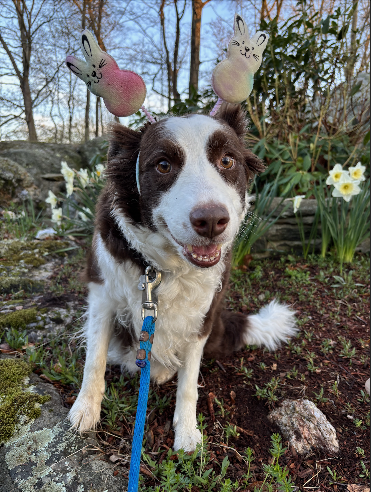
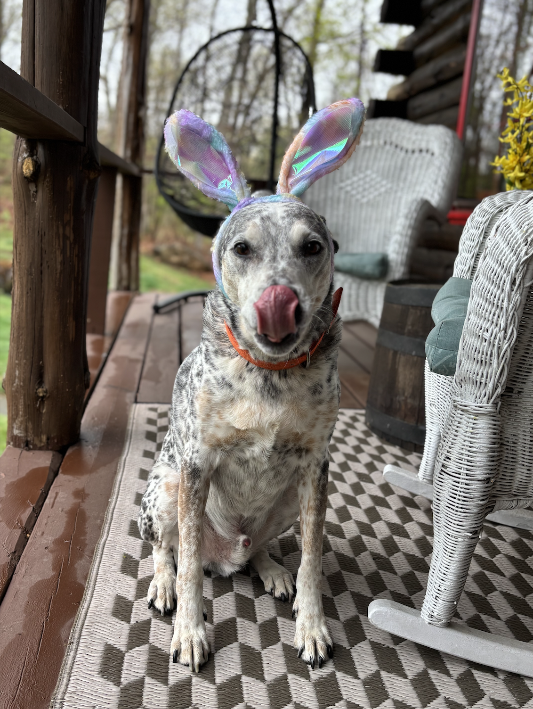

### For this portfolio, I am going to make a custom Easter Card featuring my dogs. 

For inspo, I looked at a few differnt things:

* https://albert-rapp.de/posts/ggplot2-tips/27_images/27_images
* This one helped me with how to incorporate pictures as a pattern layered onto ggplot()

* https://medium.com/@arpita_deb/r-you-ready-for-christmas-6a4191a412c1
* This is a christmas card tutorial in R, which also had some helpful tricks 

```{r echo= FALSE, message=FALSE, warning=FALSE}
library(ggplot2)
library(ggforce)
library(sf)
library(ggpubr)
library(ggimage)
library(ggpattern)
library(tidyr)
library(gghighlight)
 #the picture in question
 
```

### The background 

* made using theme_void() to get it super simple 

```{r echo=FALSE, message=FALSE, warning=FALSE}
back <- ggplot() +                      # to create a blank canvas using an empty plot
 theme_void() +                       # removing all the themes elements
  theme(
    plot.background = element_rect(   # creating a blank rectangle as our first layer of the card
      fill = "#9CAF88"                  # giving it a golden color
    ))

back
```

### Next up I add in my puppy pictures:

```{r echo=FALSE, message=FALSE, warning=FALSE}
lou2 <- png::readPNG("newlou.png")
wook2 <-png::readPNG("Wookie.png")

ggplot() +                      
 theme_void() +                       
  theme(
    plot.background = element_rect(  
      fill = "#9CAF88"                  
    )
  ) +
  background_image(lou2) +
  coord_fixed(ratio=1)#+
  #background_image(wook2)

# ggplot() +                      
#  theme_void() +                       
#   theme(
#     plot.background = element_rect(   
#       fill = "#9CAF88"                  
#     )
#   ) +
#   geom_image(aes(image = "newlou.png"))

```

# Take two: This uses geom_tile_pattern as a workaround to including images, and then layers on theme_void(): 

```{r echo=FALSE, message=FALSE, warning=FALSE}
tibble(id = 0:1, row = id %% 1, col = id %/% 1) %>%
  

  ggplot(aes(x = col, y = row)) +
  geom_tile_pattern(
    fill = '#9CAF88', 
    col = 'transparent', 
    linewidth = .1,
    pattern = 'image',
    pattern_filename = 'newlou.png'
  ) +
  coord_equal() +
  labs(
    title = 'Random waffle',
    caption = 'Flaticon Icon by Us and Up'
  ) +
  theme_void(base_size = 18, base_family = 'Source Sans Pro')
```

### I want both dogs in the picture but that is hard 
```{r echo=FALSE, message=FALSE, warning=FALSE}

tibble(id = 1:1, row = id %% 1, col = id %/% 1) %>%
  
  ggplot(aes(x = col, y = row)) +
  geom_tile_pattern(
    fill = '#9CAF88', 
    col = 'gold', 
    linewidth = .1,
    pattern = 'image',
    pattern_filename = 'Wookie.png'
  ) +
  coord_equal() +
  labs(
    title = 'Who needs a Chocolate Bunny When You Can have the Real Thing?',
    caption = 'The Eastern Bunny is in a Better Place'
  ) +
  theme_minimal() +
  theme(text = element_text(family = "Baskerville", color = "#675746", size = 15),
        subtitle.text = element_text(family = "Baskerville", color = "#675746", size = 15),
        axis.text.x = element_blank(),
        axis.title.x = element_blank(),
        axis.text.y = element_blank(),
        axis.title.y = element_blank(),
        panel.grid.major= element_blank(),
        panel.grid.minor = element_blank(), #,
      #  plot.title.position = 
      #  plot.caption.position = 
      plot.background = element_rect(color = "#9CAF88"),
      panel.background = element_rect(color = "#9CAF88")) 

```


### Another version: 

```{r echo=FALSE, message=FALSE, warning=FALSE}

v2 <- tibble(id = 1:1, row = id %% 1, col = id %/% 1) %>%
    ggplot(aes(x = col, y = row)) +
  geom_tile_pattern(
    fill = '#9CAF88', 
    col = 'gold', 
    linewidth = .1,
    pattern = 'image',
    pattern_filename = 'Wookie.png'
  ) +
  coord_equal() +
#  labs(
 #   title = 'Who needs a Chocolate Bunny When You Can have the Real Thing?',
#    caption = 'The Eastern Bunny is in a Better Place'
#  ) +
  theme_minimal() +
  theme(text = element_text(family = "Baskerville", color = "#675746", size = 15),
     #   subtitle.text = element_text(family = "Baskerville", color = "#675746", size = 15),
        axis.text.x = element_blank(),
        axis.title.x = element_blank(),
        axis.text.y = element_blank(),
        axis.title.y = element_blank(),
        panel.grid.major= element_blank(),
        panel.grid.minor = element_blank(), #,
      #  plot.title.position = 
      #  plot.caption.position = 
      plot.background = element_rect(color = "#675746"),
      panel.background = element_rect(color = "#675746")) 


v2 <- v2 +
  annotate(
    geom = "text",                 
    x = 1, y = .6,            
    label = "Who needs a Chocolate Bunny\n When You Can have the Real Thing?", 
    colour = "#675746",              
    family = "Baskerville",               
    fontface = "italic", size = 5
   # face = "bold" ,
  ) +
    annotate(
    geom = "text",                
    x = 1, y = -.6,             
    label = "...The Eastern Bunny is in a Better Place", 
    colour = "#675746",                
    family = "Baskerville",               
    fontface = "italic", size = 5
   # face = "bold" ,
  ) 
   

v2

```

## To get front and back: Why is This So Hard?? 

```{r message=FALSE, warning=FALSE, results='hide'}

v21 <- tibble(id = 1:1, row = id %% 1, col = id %/% 1) %>%
    ggplot(aes(x = col, y = row)) +
  geom_tile_pattern(
    fill = '#9CAF88', 
    col = 'gold', 
    linewidth = .1,
    pattern = 'image',
    pattern_filename = 'Wookie.png'
  ) +
  coord_equal() +
#  labs(
 #   title = 'Who needs a Chocolate Bunny When You Can have the Real Thing?',
#    caption = 'The Eastern Bunny is in a Better Place'
#  ) +
  theme_minimal() +
  theme(text = element_text(family = "Baskerville", color = "#675746", size = 15),
     #   subtitle.text = element_text(family = "Baskerville", color = "#675746", size = 15),
        axis.text.x = element_blank(),
        axis.title.x = element_blank(),
        axis.text.y = element_blank(),
        axis.title.y = element_blank(),
        panel.grid.major= element_blank(),
        panel.grid.minor = element_blank(), #,
      #  plot.title.position = 
      #  plot.caption.position = 
      plot.background = element_rect(color = "#675746"),
      panel.background = element_rect(color = "#675746")) 


v21 <- v21 + #I got this annotate trick from the christmas card tutorial 
  annotate(
    geom = "text",                
    x = 1, y = .6,            
    label = "Who needs a Chocolate Bunny\n When You Can have the Real Thing?", 
    colour = "#675746",              
    family = "Baskerville",             
    fontface = "italic", size = 5
   # face = "bold" ,
  ) 
 
  
v3 <- tibble(id = 1:1, row = id %% 1, col = id %/% 1) %>%
    ggplot(aes(x = col, y = row)) +
  geom_tile_pattern(
    fill = '#9CAF88', 
    col = 'gold', 
    linewidth = .1,
    pattern = 'image',
    pattern_filename = 'newlou.png'
  ) +
  coord_equal() +
#  labs(
 #   title = 'Who needs a Chocolate Bunny When You Can have the Real Thing?', #my mom came up with this line while we were yapping
#    caption = 'The Eastern Bunny is in a Better Place' #this is me
#  ) +
  theme_minimal() +
  theme(text = element_text(family = "Baskerville", color = "#675746", size = 15),
     #   subtitle.text = element_text(family = "Baskerville", color = "#675746", size = 15),
        axis.text.x = element_blank(),
        axis.title.x = element_blank(),
        axis.text.y = element_blank(),
        axis.title.y = element_blank(),
        panel.grid.major= element_blank(),
        panel.grid.minor = element_blank(), #,
      #  plot.title.position = 
      #  plot.caption.position = 
      plot.background = element_rect(color = "#675746"),
      panel.background = element_rect(color = "#675746")) 
  
  
v3 <- v3 +  annotate(
    geom = "text",                 
    x = 1, y = .6,           
    label = "...The Eastern Bunny is in a Better Place",
    colour = "#675746",                
    family = "Baskerville",              
    fontface = "italic", size = 5
   # face = "bold" ,
  ) 

v3 <- v3 + annotate(
    geom = "text",                 
    x = 1, y = -.6,           
    label = "Happy Spring From Wookie & Mr.Louie",
    colour = "#675746",                
    family = "Baskerville",              
    fontface = "italic", size = 5
   # face = "bold" ,
  ) +
  geom_image(
    aes(image = "bunny.jpeg", 
        #size = 0.01,
        nudge_x = 3
       ))
```

```{r echo=FALSE, message=FALSE, warning=FALSE}
v21 
v3
```

### So much work for something so mid. I can't seem to move the bunny to any other location than dead center. I'm over it. 